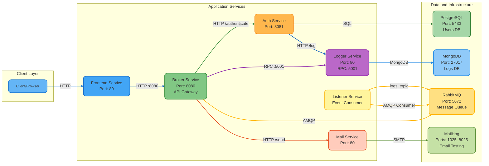

# Go Microservices Architecture

This project is a microservices-based application built with Go, demonstrating a distributed system architecture with multiple services, databases, and message queues.

## Architecture Overview



## Services

### 1. Frontend Service
- **Port**: 80
- **Description**: Web frontend that provides a UI for testing microservices
- **Technology**: Go with HTML templates
- **Endpoints**: 
  - `GET /` - Test page with service interaction buttons

### 2. Broker Service (API Gateway)
- **Port**: 8080 (mapped from internal port 80)
- **Description**: Acts as the main API gateway/router for all service requests
- **Technology**: Go with Chi router
- **Endpoints**:
  - `POST /` - Health check endpoint
  - `POST /handle` - Routes requests to appropriate services based on action type
- **Responsibilities**:
  - Routes authentication requests to Auth Service
  - Routes logging requests to Logger Service (via RPC)
  - Routes mail requests to Mail Service
  - Can publish events to RabbitMQ

### 3. Auth Service
- **Port**: 8081 (mapped from internal port 80)
- **Description**: Handles user authentication
- **Technology**: Go with PostgreSQL
- **Database**: PostgreSQL (users database)
- **Endpoints**:
  - `POST /authenticate` - Authenticates users
- **Features**:
  - User authentication with email/password
  - Logs authentication events to Logger Service

### 4. Logger Service
- **Port**: 80 (HTTP), 5001 (RPC)
- **Description**: Centralized logging service
- **Technology**: Go with MongoDB, RPC support
- **Database**: MongoDB (logs database)
- **Endpoints**:
  - `POST /log` - HTTP endpoint for logging
  - RPC endpoint on port 5001 for direct logging
- **Features**:
  - Stores logs in MongoDB
  - Supports both HTTP and RPC communication

### 5. Mail Service
- **Port**: 80
- **Description**: Handles email sending
- **Technology**: Go with SMTP
- **Endpoints**:
  - `POST /send` - Sends emails
- **Features**:
  - Sends emails via SMTP
  - Uses MailHog for email testing in development

### 6. Listener Service
- **Description**: Event consumer that listens to RabbitMQ messages
- **Technology**: Go with RabbitMQ AMQP client
- **Features**:
  - Consumes messages from RabbitMQ `logs_topic` exchange
  - Listens for log events (log.INFO, log.WARNING, log.ERROR)

## Infrastructure

### Databases

#### PostgreSQL
- **Port**: 5433 (mapped from internal port 5432)
- **Database**: users
- **Used by**: Auth Service
- **Purpose**: Stores user authentication data

#### MongoDB
- **Port**: 27017
- **Database**: logs
- **Used by**: Logger Service
- **Purpose**: Stores application logs

### Message Queue

#### RabbitMQ
- **Port**: 5672
- **Used by**: Broker Service, Listener Service
- **Purpose**: Asynchronous message processing and event-driven communication
- **Exchange**: `logs_topic` (topic exchange)

### Email Testing

#### MailHog
- **Ports**: 1025 (SMTP), 8025 (Web UI)
- **Used by**: Mail Service
- **Purpose**: Email testing and development tool

## Communication Patterns

1. **HTTP/REST**: Primary communication method between services
   - Frontend → Broker Service
   - Broker Service → Auth Service
   - Broker Service → Mail Service
   - Auth Service → Logger Service

2. **RPC**: Direct procedure calls for high-performance logging
   - Broker Service → Logger Service (port 5001)

3. **AMQP/RabbitMQ**: Asynchronous event-driven communication
   - Broker Service → RabbitMQ (publishes events)
   - Listener Service → RabbitMQ (consumes events)

## Getting Started

### Prerequisites
- Docker and Docker Compose
- Go 1.21+ (for local development)

### Running the Project

1. Navigate to the project directory:
```bash
cd project
```

2. Start all services using Docker Compose:
```bash
docker-compose up --build
```

3. Access the services:
   - Frontend: http://localhost:80 (if exposed)
   - Broker Service: http://localhost:8080
   - Auth Service: http://localhost:8081
   - MailHog UI: http://localhost:8025

### Testing Services

Use the frontend test page to interact with services:
- Test Broker: Tests the broker service health
- Test Auth: Tests authentication flow
- Test Log: Tests logging via RPC
- Test Mail: Tests email sending

## Project Structure

```
go-microservices/
├── auth-service/          # Authentication service
├── broker-service/        # API gateway/broker
├── front-end/             # Web frontend
├── listener-service/      # RabbitMQ event consumer
├── logger-service/        # Logging service
├── mail-service/          # Email service
└── project/              # Docker Compose configuration
    ├── docker-compose.yml
    └── db-data/          # Database volumes
```

## Environment Variables

### Auth Service
- `DSN`: PostgreSQL connection string

### Mail Service
- `MAIL_DOMAIN`: Mail domain
- `MAIL_HOST`: SMTP host (mailhog)
- `MAIL_PORT`: SMTP port (1025)
- `MAIL_FROM_ADDRESS`: Sender email address
- `MAIL_FROM_NAME`: Sender name

## Development

Each service is a standalone Go application that can be run independently or together via Docker Compose. Services communicate through well-defined HTTP endpoints, RPC calls, or message queues.

## License

[Add your license here]

